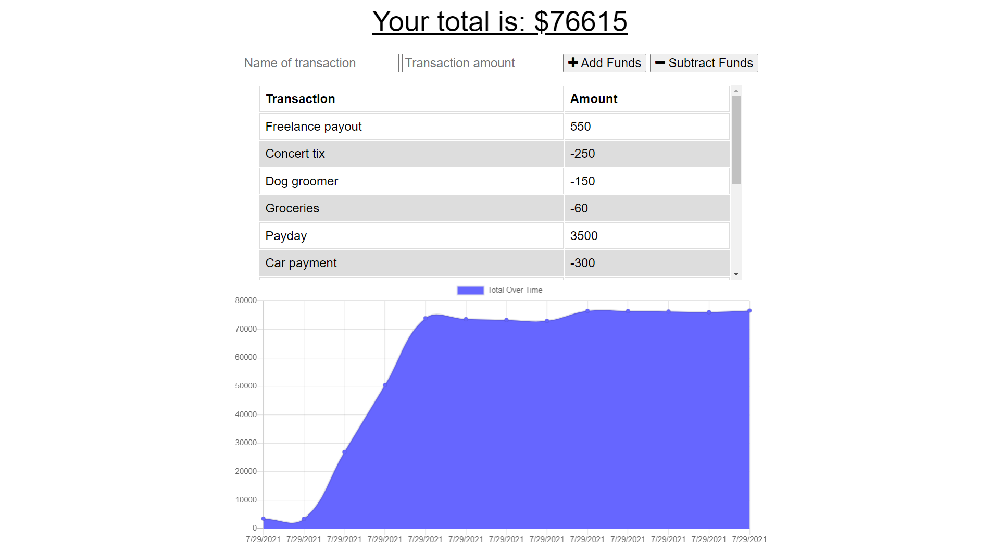

# Tech Blogger

## Contributers
* Chris Whalen, Github: **[CobaltFrostfish](https://github.com/CobaltFrostfish)**

## Links
* **[Repository](https://github.com/CobaltFrostfish/budget-tracker)**
* **[Live App](https://gentle-wave-63951.herokuapp.com/)**
# 

## The project
The Budget Tracker is a simple tool you can use to budget your finances. The app can be used online or offline and all of your inputted info will be saved and added when you're back online. So go ahead and give the budget tracker a try!

## Technologies applied
* JavaScript
* NodeJS
* Express
* Mongo DB
* Atlas
* Heroku
* CSS
* MyBrain
* Google

## The final production:

